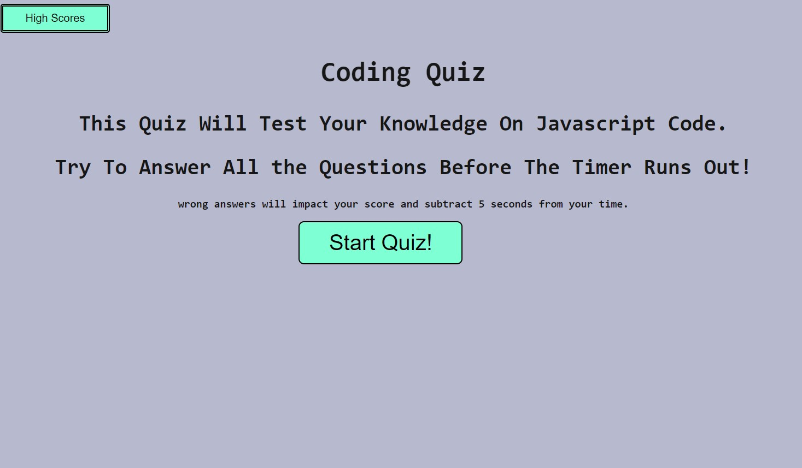
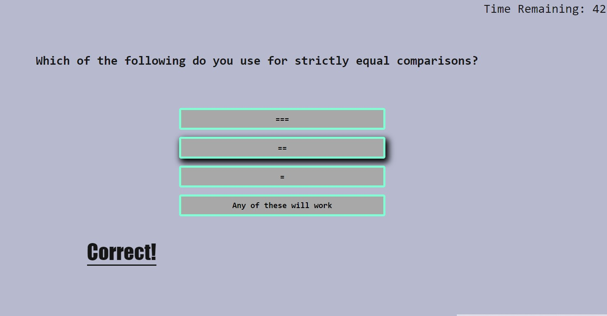
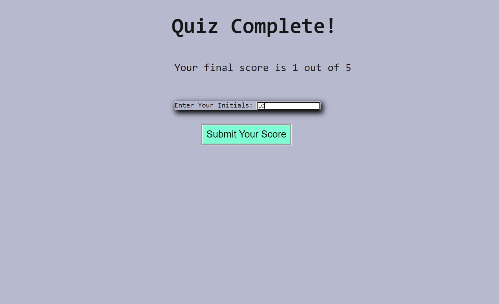
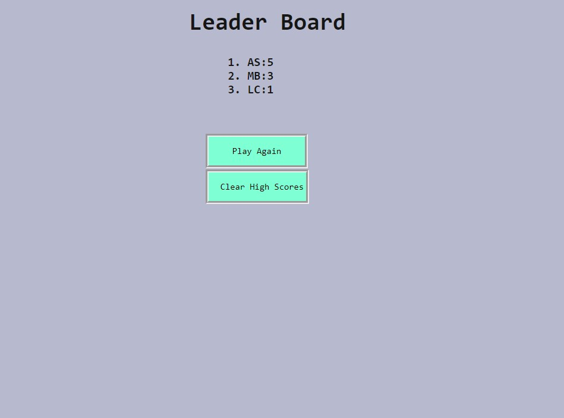

# Web APIs: Javascript Code Quiz

This is a timed quiz to test your knowledge on basic Javascript.

It stores your high score so that you can compare your scores to your friends.

Desisned to be functional with all screen sizes

Link to the deployed site:

# Functionality

WHEN you click the start button
THEN you will be directed to the quiz questions and a timer counts down.

When you answer a question 
THEN you will be presented with the next question

IF you answer correctly
THEN the message "correct!" will appear and it will count a point to your score

IF you answer incorrectly
THEN the message will say "incorrect" and 5 seconds will be deducted from your time

WHEN the timer runs out or you answer all the  questions
THEN the game is ended and you are presented with your score and prompted to enter your initials

WHEN you enter your intitals
THEN your score will be displayed on the leaderboard

IF you scored higher than a previous leader score
THEM your score will be displayed above theirs

IF you want to clear scores from the leaderboard
THEN clicking the "clear scores" button will delete past data

IF you want to play again
THEN click the "play again" button to go back to the main screen

# Screenshots of Website

